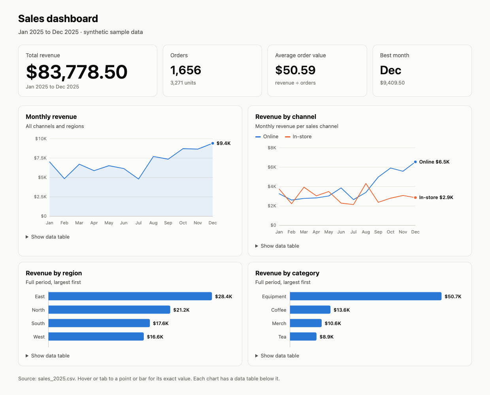

# Sales Dashboard (CSV in, HTML dashboard and Excel charts out)

A Python command-line tool that turns a sales export into two things a manager can open straight away:

- **`output/dashboard.html`**: a one-page dashboard with four headline numbers and four charts. It is a single file with the charts drawn as inline SVG, so it opens offline, can be emailed, and needs no server or chart library.
- **`output/sales_report.xlsx`**: a Summary sheet with the same numbers and **four native Excel charts** (you can restyle them, and they are not pictures), plus an Orders sheet with every cleaned row as a filterable Excel table.



Built with AI assistance, reviewed and tested by Noah.

## What's on the dashboard

| Section | Shows |
|---|---|
| Headline numbers | Total revenue (the one big number), orders and units, average order value, best month |
| Monthly revenue | Line chart with the latest month labelled |
| Revenue by channel | Online vs in-store per month, with a legend and end labels |
| Revenue by region | Horizontal bars, largest first, value at the end of each bar |
| Revenue by category | Same layout as region |

Design choices that make it readable:

- **Colorblind-safe colors.** The two series colors were run through a palette checker for color-vision deficiency and contrast, on both light and dark backgrounds. Single-series charts use one color only.
- **Never color alone.** The channel chart has a legend and direct labels. Every chart has a "Show data table" twin with the exact numbers.
- **One axis per chart**, round tick values ($0 / $2.5K / $5K), light gridlines.
- **Hover or Tab** to a point or bar to see its exact value (native tooltips, so no JavaScript).
- **Light and dark mode** follow the viewer's system setting. The layout stacks to one column on a phone.
- Labels are sized before they are placed, so none are clipped. A test checks this.

## Usage

```bash
pip install -r requirements.txt        # openpyxl (Excel output) and pytest (tests)
python3 sales_dashboard.py input/sales_2025.csv --out output
```

```
1656 orders read, 0 skipped · Jan 2025 to Dec 2025
  revenue $83,778.50 · avg order $50.59 · best month Dec
Wrote output/dashboard.html and output/sales_report.xlsx
```

Options: `--title "Q4 sales"` sets the page title. `--no-xlsx` writes only the HTML dashboard, which needs nothing beyond the Python standard library.

### Input

One row per order, with these columns (header case and extra spaces don't matter):

```
order_id,order_date,region,channel,category,product,units,unit_price,revenue
SO-00002,2025-01-01,North,Online,Coffee,House Blend 1 lb,1,14.00,14.00
```

Dates are `YYYY-MM-DD`. Money may include `$` and thousands commas. A missing column stops the run with a clear message. A row with a bad date, a non-number, or a blank region/channel/category/product is **skipped and reported with its line number**, never guessed. Months with no sales still appear on the charts as zero.

## Limits

- Built for one currency and a period of up to a couple of years (the month axis gets crowded past about 24 months).
- The channel chart colors the two largest channels. A third channel would need an "Other" group; the palette is kept to two validated colors on purpose.
- The Excel Summary holds values calculated by the script, not live formulas. Re-run the script after the data changes.
- For Google Sheets or Looker Studio, the Summary tables are ready to import as chart sources. This sample doesn't connect to either.

## Tests

```bash
python3 -m pytest -q
```

The 16 tests run offline. They cover column and row validation (with line numbers for skipped rows), headline numbers checked against an independent sum of the CSV, every breakdown adding back to the total, tick and money formatting, the HTML being self-contained (no external scripts, styles or links) with four well-formed SVG charts and four data tables, HTML escaping of labels, no label running past its chart, both color modes, and the Excel file containing four native charts (two line, two bar) with visible axes and the checked colors.

**What was and wasn't verified:** the dashboard was rendered in headless Chrome for the screenshot above (at desktop width and a narrow 500px width). The Excel file was checked by reading its chart XML and cell values, and its tables were viewed in macOS Quick Look. Quick Look doesn't draw charts, and the file has not yet been opened in Microsoft Excel or Google Sheets.

## Data

`input/sales_2025.csv` is synthetic: a made-up shop selling coffee, tea, equipment and merchandise in four regions during 2025. `make_sample_data.py` generates it from a fixed random seed, and a test checks the committed file matches. It does not describe any real business.
